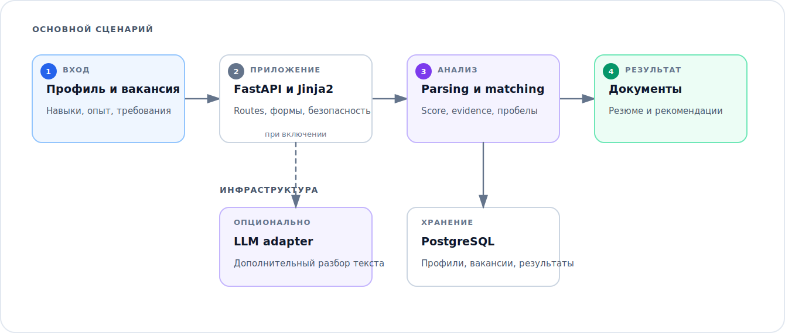
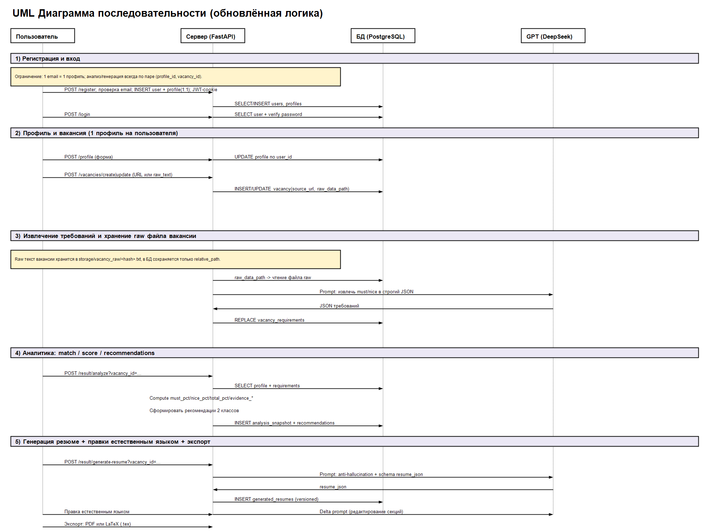
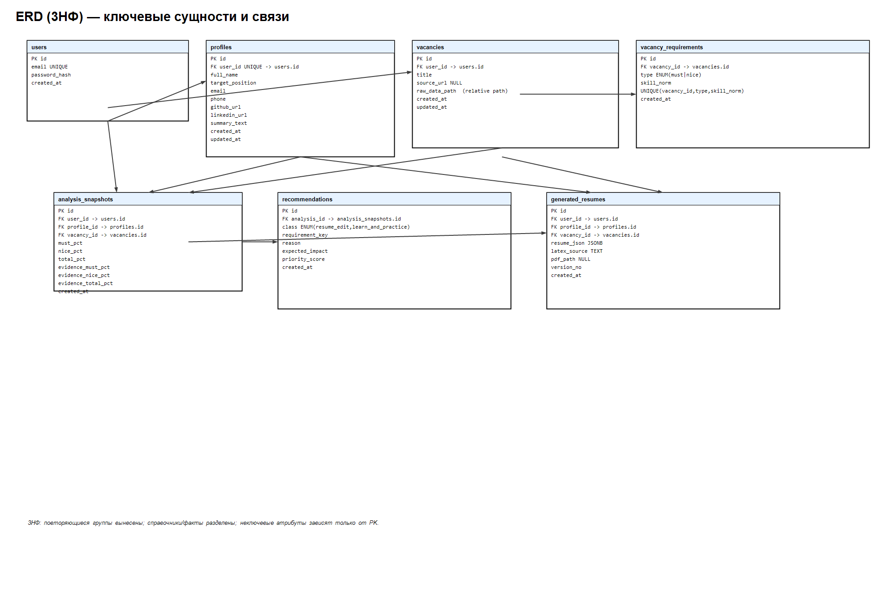
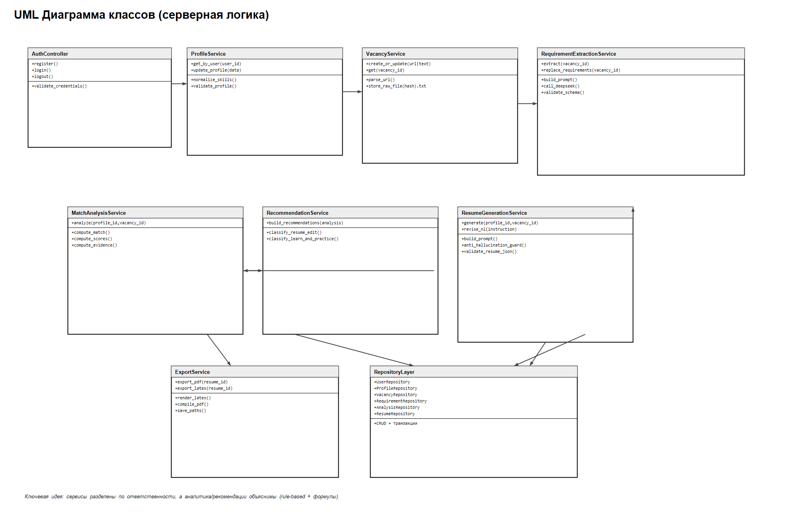

# Анализ соответствия вакансии

FastAPI-приложение сравнивает профиль кандидата с вакансией: извлекает требования, показывает evidence для рассчитанного match score и готовит адаптированные резюме и сопроводительное письмо.

Идея появилась как учебный проект. Текущая версия упакована, покрыта тестами и работает без внешнего AI-сервиса.

## Основной сценарий

```text
профиль кандидата + текст вакансии
                 |
                 v
      нормализованные требования
                 |
                 v
     evidence-based match и пробелы
                 |
                 v
       резюме и сопроводительное письмо
```

Профили, навыки, вакансии, нормализованные требования и созданные документы хранятся в PostgreSQL отдельно. Один профиль можно анализировать против нескольких вакансий без дублирования исходных данных.

Детерминированный сценарий локально выполняет parsing, matching и подготовку документов. DeepSeek-совместимый API можно подключить для дополнительной помощи с текстом и разбором вакансии, но основная логика от него не зависит.

## Архитектурные диаграммы



Подробные схемы сохранены для технического разбора. Они открываются по клику и не перегружают основное описание:

<details>
<summary>Последовательность обработки вакансии</summary>

[](docs/assets/uml_sequence.png)

Редактируемый исходник: [`docs/ats_sequence_flow.drawio`](docs/ats_sequence_flow.drawio).

</details>

<details>
<summary>Модель данных</summary>

[](docs/assets/erd_3nf.png)

</details>

<details>
<summary>Основные классы</summary>

[](docs/assets/class_diagram.png)

</details>

## Расчёт соответствия

Каждое требование получает оценку на основе точных навыков, связанных навыков и подтверждений в профиле. Обязательные требования имеют больший вес:

```text
total_match = 0.75 * must_have_match + 0.25 * nice_to_have_match
```

Интерфейс показывает найденные подтверждения, а не только итоговый процент.

## Стек

Python 3.12, FastAPI, Jinja2, PostgreSQL 16, SQLAlchemy 2, Alembic, Pydantic, Pytest, Ruff, Docker Compose и GitHub Actions.

## Запуск через Docker

```bash
cp .env.example .env
docker compose up --build
```

Приложение доступно на <http://localhost:8000>. Для основного сценария LLM key не нужен. За пределами локального запуска необходимо заменить `SECRET_KEY` и `POSTGRES_PASSWORD` в `.env`.

Остановить стенд: `docker compose down`. Флаг `-v` следует добавлять только при намеренном удалении локальной БД и созданных документов.

## Локальный запуск

```bash
python -m venv .venv
python -m pip install -r requirements-dev.txt
alembic upgrade head
python -m uvicorn apps.web.main:app --reload
```

Предварительно скопируйте `.env.example` в `.env` и задайте `DATABASE_URL` для локального PostgreSQL.

## Проверки

```bash
ruff check .
ruff format --check .
pytest
python -m compileall apps core
docker compose config -q
```

Тесты покрывают routes, границы аутентификации, parsing вакансий, matching, рекомендации, профили, интеграцию с hh.ru и fallback-сценарии создания документов. Сетевые и LLM-вызовы заменяются контролируемыми test doubles.

## Структура

```text
apps/api/       модели БД, схемы и repositories
apps/web/       routes, сервисы, templates и static
config/         безопасные настройки локальной разработки
core/           конфигурация, security и общие утилиты
docs/           архитектурные диаграммы
storage/        игнорируемые runtime-данные
tests/          unit- и web-тесты
```

## Ограничения

- Score помогает систематизировать подтверждения, но не является решением о найме.
- Карта связанных навыков построена на явных эвристиках и требует калибровки под конкретную роль.
- Созданный текст необходимо проверить перед отправкой.
- В HTML-формах пока нет CSRF-токенов, поэтому сервер предназначен для локального case study, а не для публикации в интернете.
- Для production также потребуются managed secrets, HTTPS, rate limiting и фоновая очередь для тяжёлых задач.

Лицензия GPL-3.0: [LICENSE](LICENSE).
